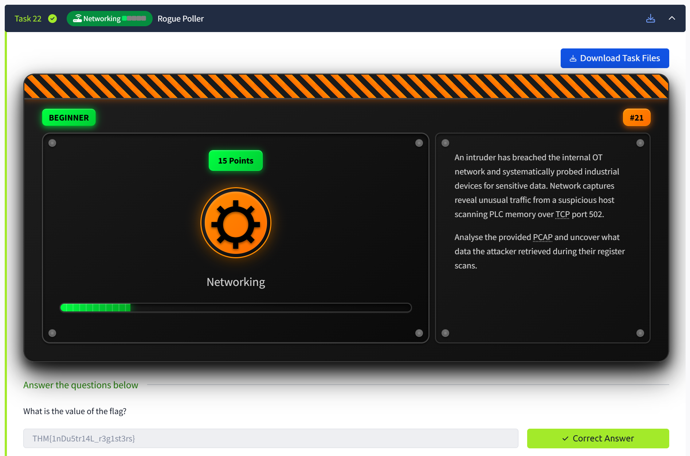
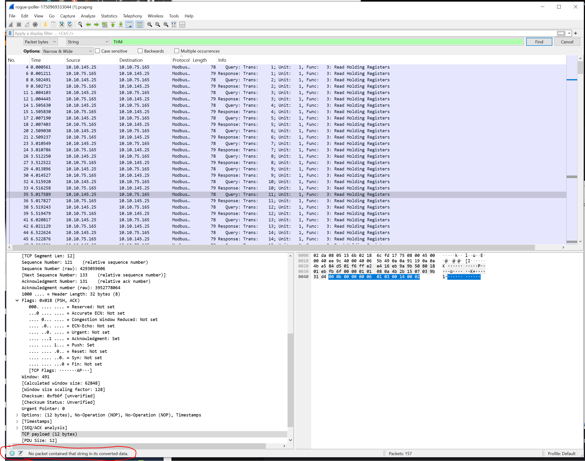
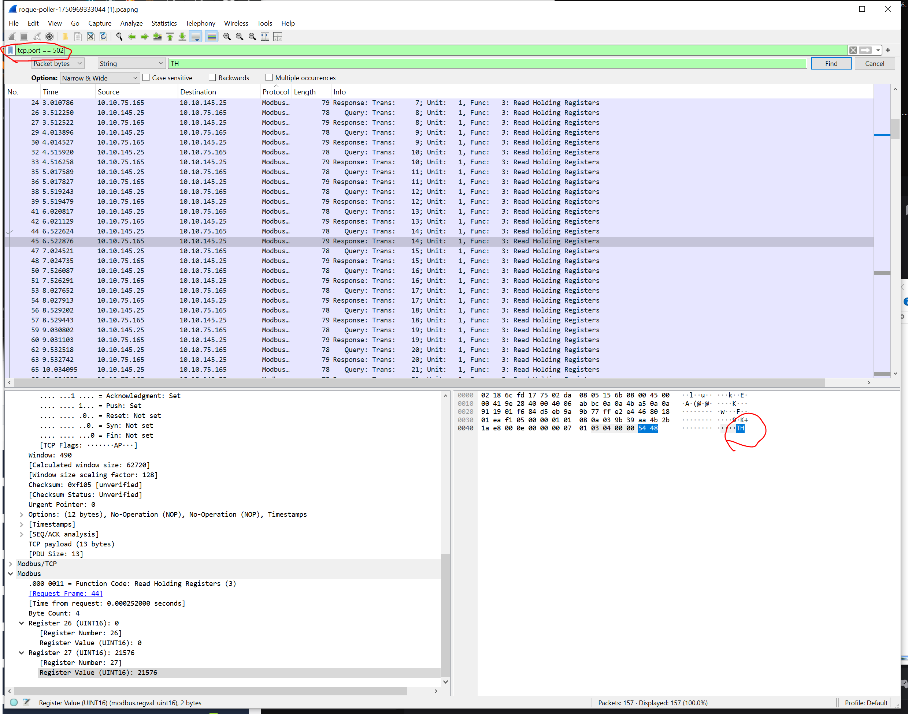
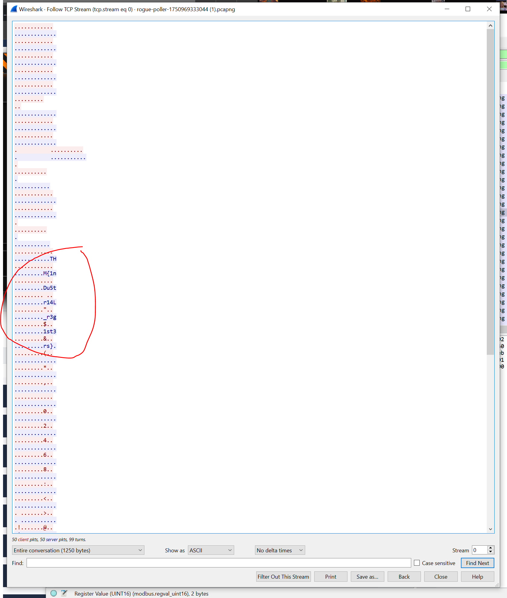

🕵️ Challenge Name: Industrial Intrusion CTF - Task 22 Rogue Poller (Networking)
Platform: TryHackMe

Category: Networking

Points: 15

Difficulty: Beginner

📝 Description
An intruder has breached the internal OT network and systematically probed industrial devices for sensitive data. Network captures reveal unusual traffic from a suspicious host scanning PLC memory over TCP port 502.

Analyse the provided PCAP and uncover what data the attacker retrieved during their register scans.

🧠 Approach
🔍 Step 1: Initial Recon
The challenge provided a .pcaPNG capture file. I opened it using Wireshark.

🧪 Step 2: Investigation
I began by searching for the flag using Ctrl+F with "THM{" in packet bytes, but it didn’t return any results. This hinted that the flag might be split across multiple TCP packets or encoded in some way.

🔁 Step 3: Follow TCP Stream
Explain how you followed the stream:

I filtered traffic using tcp port 502 and selected a packet that contained string "TH". 

Then I right-clicked and chose Follow → TCP Stream, which showed a reassembled chat or file transfer. The flag is visible in fragmented form. Copy-paste into text editor and cleanup to get the final flag.

🏁 Flag
THM{1nDu5tr14L_r3g1st3rs}
💬 Notes
Sometimes Wireshark searches won’t work if flags are split across packets.

Following the TCP or HTTP stream is essential for seeing reassembled data.

If you’re stuck, look for base64 strings or large blobs of data that could be hiding something.